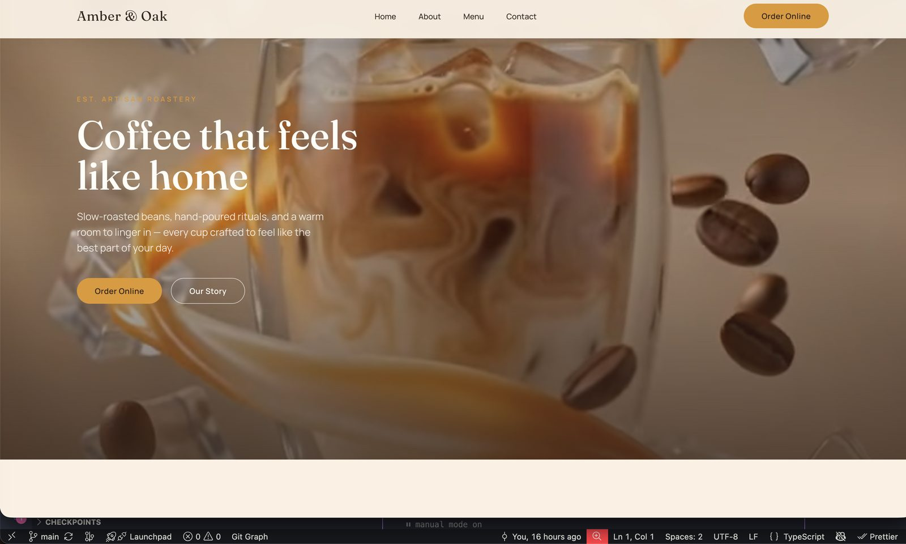
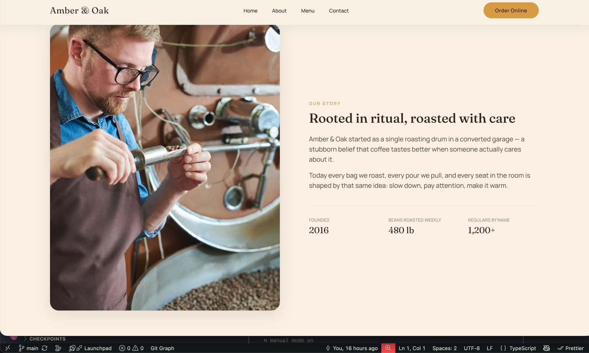
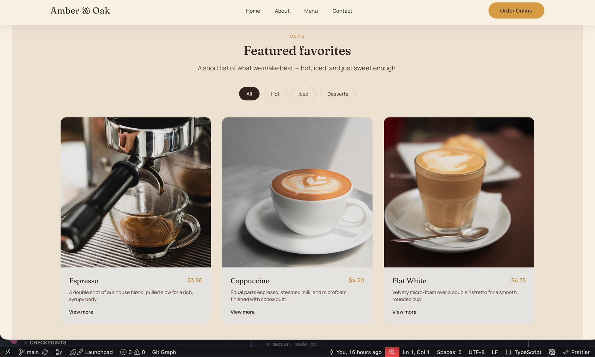
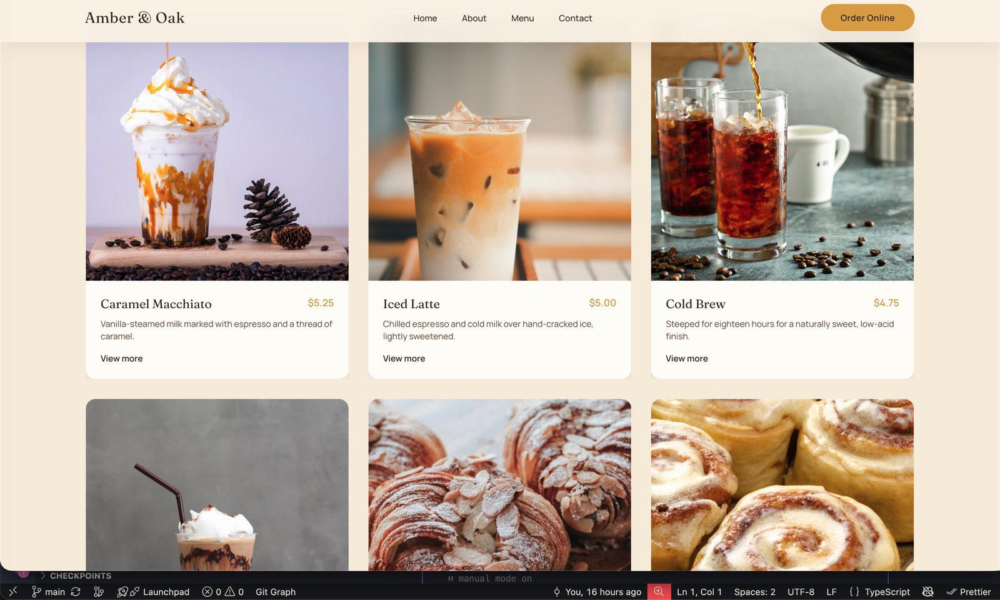
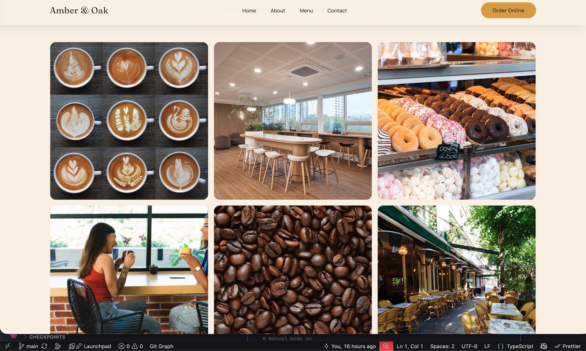
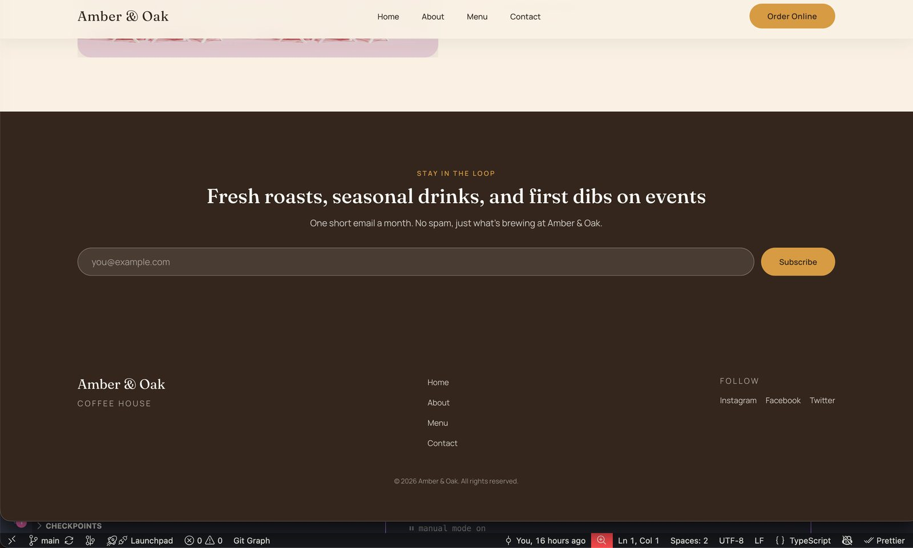
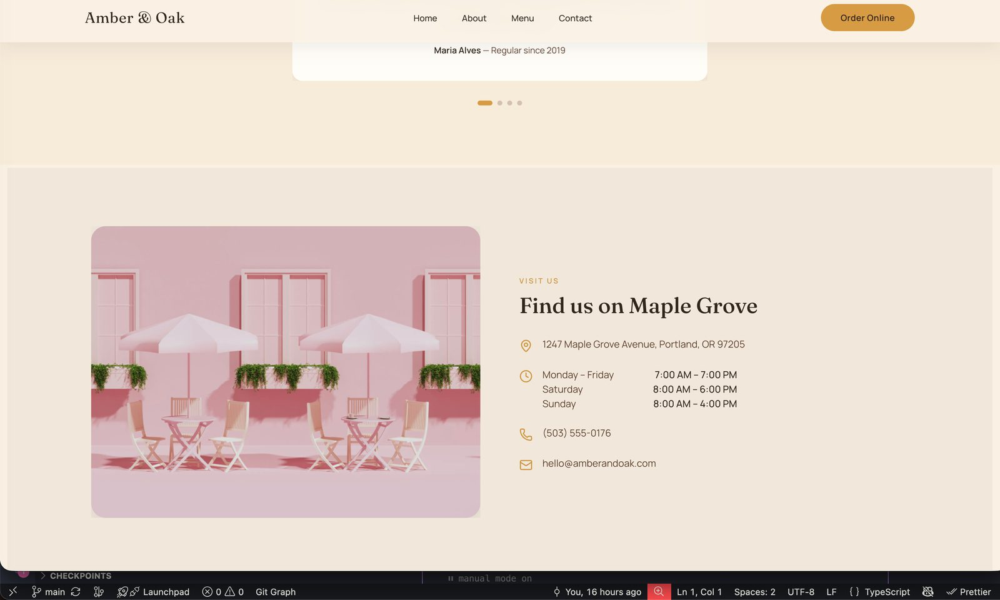

# Amber & Oak — Coffee House

A modern, animated marketing site for a fictional specialty coffee house, built to showcase a polished, production-quality frontend: smooth scroll-driven motion, an accessible component system, and a full automated test suite (unit, integration, accessibility, and end-to-end).

**Live demo:** [amber-coffee-house.vercel.app](https://amber-coffee-house.vercel.app)



---

## ✨ Features

- **Cinematic hero** with parallax and mask-reveal scroll animation
- **Filterable menu** — browse drinks and desserts by category (`All`, `Hot`, `Iced`, `Desserts`)
- **Story / About section** with animated stat counters
- **Photo gallery** of the space, drinks, and roastery
- **Testimonial carousel** with autoplay and manual navigation
- **Newsletter signup** with client-side email validation
- **Location & hours** section with contact details
- **Fully responsive** — tested from mobile to desktop breakpoints
- **Accessible by design** — semantic markup, keyboard navigation, and automated a11y testing with `axe`

## 📸 Screenshots

| Hero | About |
|---|---|
|  |  |

| Menu | Menu — filtered |
|---|---|
|  |  |

| Gallery | Newsletter & Footer |
|---|---|
|  |  |

| Location |
|---|
|  |

## 🛠️ Tech Stack

**Core**
- [React 19](https://react.dev) + [TypeScript](https://www.typescriptlang.org)
- [Vite](https://vitejs.dev) — build tool & dev server
- [Tailwind CSS](https://tailwindcss.com) — utility-first styling

**Animation**
- [GSAP](https://gsap.com) (+ `@gsap/react`) — scroll-driven and timeline animation
- [Framer Motion](https://www.framer.com/motion) — component-level motion

**Tooling & Quality**
- [ESLint](https://eslint.org) + [Prettier](https://prettier.io) (with Tailwind class sorting)
- [Vitest](https://vitest.dev) + [Testing Library](https://testing-library.com) — unit & integration tests
- [vitest-axe](https://github.com/chaance/vitest-axe) — automated accessibility testing
- [Playwright](https://playwright.dev) — end-to-end testing
- [Lucide React](https://lucide.dev) — icon set

## 📁 Project Structure

```
src/
├── app/                  # App root
├── features/             # Feature-based sections (hero, menu, gallery, footer, ...)
│   └── <feature>/
│       ├── components/   # Feature-scoped components
│       ├── hooks/        # Feature-scoped hooks
│       ├── data.ts       # Static content/data
│       └── <Feature>.tsx
├── shared/                # Cross-feature building blocks
│   ├── components/       # Reusable UI (Button, Container, Reveal, ...)
│   ├── hooks/             # Reusable hooks (scroll, media query, parallax, ...)
│   ├── constants/        # Site-wide constants
│   └── lib/                # Utilities (GSAP setup, validation, scroll helpers)
└── test/                  # Test setup & global accessibility tests

e2e/                       # Playwright end-to-end specs
qa/                        # Manual QA checklists & test plan
```

## 🚀 Getting Started

### Prerequisites

- [Node.js](https://nodejs.org) 20+
- npm

### Installation

```bash
git clone https://github.com/elispethke/Amber-Coffee-House.git
cd Amber-Coffee-House
npm install
```

### Development

```bash
npm run dev
```

The app will be available at `http://localhost:5173`.

### Build

```bash
npm run build
npm run preview   # preview the production build locally
```

## ✅ Testing

```bash
npm run test           # unit & integration tests (Vitest)
npm run test:watch     # watch mode
npm run test:coverage  # coverage report
npm run test:e2e       # end-to-end tests (Playwright)
```

## 🔍 Code Quality

```bash
npm run lint          # lint
npm run lint:fix      # lint with autofix
npm run format        # format with Prettier
npm run format:check  # check formatting
npm run typecheck     # TypeScript type checking
```

## 🎨 Design Notes

The visual language leans on a warm, editorial palette (espresso, ivory, amber) paired with a serif display type for headings — evoking a small-batch, artisan coffee brand. Motion is used purposefully: parallax and reveal effects on scroll, subtle hover states, and a mask-reveal hero, all built to stay performant and respect reduced-motion preferences.

## 📄 License

This project is provided for portfolio and demonstration purposes.

---

<p align="center">
  Developed by <a href="https://www.eproxstudio.com"><strong>Eprox Studio</strong></a>
</p>
